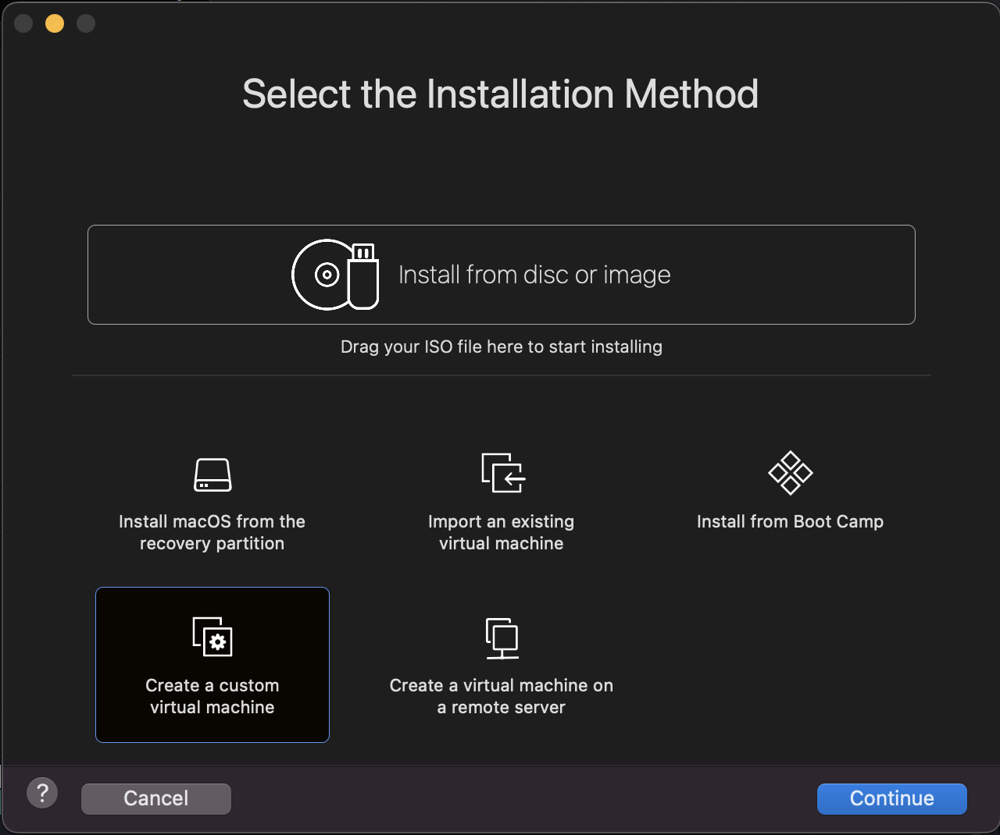

# Lab 1:   Setup: VMWare Pro, Multipass, AWS EC2

## Setup VMWare Workstation Pro + Obtain Personal Use Licence

Disclaimer: this setup require creating account on Broadcom.com Website. It's recommended to download the VMWare Workstation Pro over the VirtualBox due to it's higher performance and product quality; although if you are not willing to use VMWare software, VirtualBox is an alternative. Please ask your instructor if you chose this path.

Please Navigate to the address below and Click to donwload the VMWare software base on your OS:
- [Download Address](https://blogs.vmware.com/workstation/2024/05/vmware-workstation-pro-now-available-free-for-personal-use.html)
- For MacOS: VMware Fusion Pro Download
- For Windows and Linux: VMware Workstation Pro Download

1. Sign up on Broadcom.com website and login

2. Search for the VMWare Workstation Pro product

3. Download the Software base on your OS

4. On the upcoming page, Download the lastest version of the software.
5. After it's downloaded, install the VMWare software.

## Install Ubuntu Desktop OS on VMWare Workstation Pro

1. Download the latest LTS version of Ubuntu from [Ubuntu.com](https://ubuntu.com/download/desktop)
2. After download of Ubuntu `.ios` file.
3. Move over to VMWare Workstation Pro. Proceed to create a new Virtual Machine. (Note: your VMWare dashboard/UI most probably are different)

4. Choose Ubuntu 64 bit as the type of the OS you want to install on your new VM.

5. Choose Lagacy BIOS as the Firmware Type:

6. Create a new Virtual Disk. (20 GB should be enough)

7. You can leave the rest of the setting as default and Finilize the setup.
8. Before you start our VM for the first time. you need to connect the .iso file as an external drive such as CD/DVD Drive. (this would be similar when you have inserted a DVD disk of Ubuntu installation into the machine)

9. Start/Run the VM you just created. Select Install Ubuntu Option.

10. Select next multiple time to get to the page below; select Intractive Installation.

11. Hit Next and accept the default for the next 2 more pages till you get to the page below. Choose to Erase the Disk and Install the Ubuntu.

12. Create a user account.

13. Hit Next, and choose your Time Zone and hit next again.
14. Last page before the installatio begin you can review your installation configurations. Hit Install.

15. After Installation is done. Login to your VM and update.
```sh
sudo apt update && sudo apt upgrade -y
```

## Installing and Using Multipass on Your Computer

Multipass is a lightweight VM manager for Linux, Windows, and macOS that allows you to create, manage, and configure Ubuntu instances with ease. Follow these steps to install Multipass on your computer:

1. Download and Install Multipass:
- Go to the Multipass download page (https://multipass.run/install).
- Download the installer and follow the installation instructions.
2. Verify the Installation:
- Open a terminal or command prompt and type:
```sh
multipass version
```
- This command should return the version of Multipass installed, confirming the installation was successful.
Using Multipass
3. Launch an Ubuntu Instance:
- To create and start a new Ubuntu instance, run:
```sh
multipass launch --name my-ubuntu
```
- Replace `my-ubuntu` with a name of your choice. This command will download the default Ubuntu image (usually the latest LTS version) and start the instance.
4. Access the Ubuntu Instance:
- To access the Ubuntu instance, use:
```sh
multipass shell my-ubuntu
```
- This command will drop you into a shell session within your Ubuntu instance, where you can start running commands as if you were using a regular Ubuntu machine.
5. Managing Instances:
- List Instances:
```sh
multipass list
```
This will show you all the instances you have created, along with their statuses.
- Stop an Instance:
```sh
multipass stop my-ubuntu
```
- Delete an Instance:
```sh
multipass delete my-ubuntu
```
After deleting an instance, run the following command to free up space:
```sh
multipass purge
```
Multipass also allows you to configure networking, mount directories from your host machine, and more. For additional commands and options, consult the Multipass documentation.

## Launching a Virtual Machine with Linux

1. Log in to your AWS Management Console.
2. Ensure that you are in the desired AWS region for this lab (N. Virginia or US East). - Open the Amazon EC2 service in the AWS Management Console.
3. Click on "Launch Instance" to start the instance launch wizard as shown below:

- Select an Amazon Machine Image (AMI) that provides a Linux-based operating system, such as Amazon Linux or Ubuntu.
4. Choose an instance type based on your requirements for CPU, memory, and storage.
5. Configure instance details:
- Number of instances: 1
- Network: Select the desired VPC and subnet
- Auto-assign Public IP: Enable
- IAM role: (optional) Select an appropriate role if needed
- Add storage:
- Adjust the size and type of the root volume if necessary.
- Configure security groups:
- Create a new security group and configure inbound rules to allow SSH access (port 22) from
your IP address.
- Review the instance details and click "Launch."
- Select an existing key pair or create a new one to access the instance securely via SSH (Download the
key pair file to your local machine).
6. Launch the instance and wait for it to start.
7. Once the instance is running, note down the public IP address.
8. Change the permissions of the key pair file to the appropriate permissions
9. Connect to the VM using SSH from your computer and run some basic Linux commands like: `ls`, `pwd`, `hostname`.