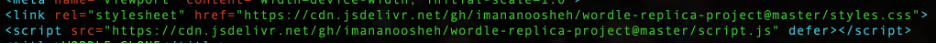
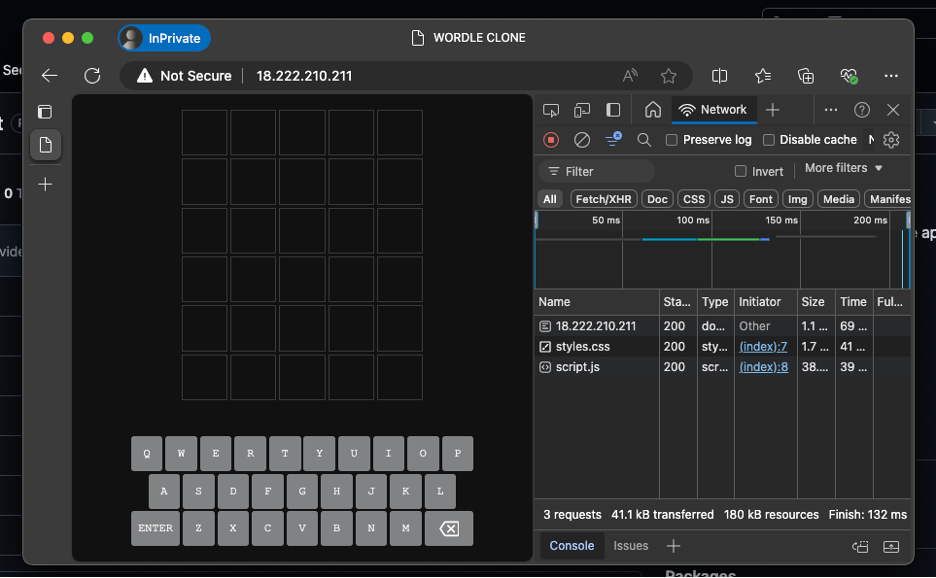

# Lab 10: CDN and Logging

In this lab, we will examine the benefits of using a Content Delivery Network (CDN) by measuring and comparing website loading latency. We’ll set up two scenarios to observe the latency difference in milliseconds.

## Part 1: Setting Up CDN vs. Local Hosting
This lab will only be using two free-tier AWS EC2 instances:
1.	Instance 1 (vm-hosting-statics): Hosts the HTML and all static files (CSS, JavaScript).
2.	Instance 2 (vm-using-cdn): Uses CDN to serve static assets, with CDN file links hosted on jsDelivr.

**Steps:**
1. Launch EC2 Instances
- Launch two AWS EC2 instances with t2.micro type and Ubuntu OS.
- Ensure to ONLY check the 'Allow HTTP traffic from the internet' option during setup. 


2.	Install Nginx
- SSH into each instance and update the system, then install Nginx:

```sh
sudo apt update && sudo apt install nginx -y
```

3.	Prepare each VM for testing:
- Clone the Wordle Puzzle Game Replica from GitHub:
Repo: [Wordle Game Repo](https://github.com/imananoosheh/wordle-replica-project/)

```sh
git clone https://github.com/imananoosheh/wordle-replica-project.git
```

4.	Set Up `vm-hosting-statics` with Local Assets
- Copy the required files (index.html, script.js, styles.css) into the public web directory:

```sh
sudo cp index.html script.js styles.css /var/www/html/
```

- Remove the default Nginx page:

```sh
sudo rm /var/www/html/index.nginx-debian.html
```

- Check the Nginx syntax and restart the server:

```sh
sudo nginx -t
sudo systemctl restart nginx
```

- Test the Wordle app in the browser at: `http://<vm-hosting-statics-IP>`

5.	Set Up vm-using-cdn with CDN Links
- If not done, clone the GitHub repository as above.
- Modify index.html to replace CSS and JavaScript file paths with CDN URLs:
- CDN URLs for the static files (CSS and JS):
    - JavaScript: https://cdn.jsdelivr.net/gh/imananoosheh/wordle-replica-project@master/script.js
    - CSS: https://cdn.jsdelivr.net/gh/imananoosheh/wordle-replica-project@master/styles.css

Before:
 
After:


- Copy index.html into the public web directory: 

```sh
sudo cp index.html /var/www/html/
```

- Remove the default Nginx page and restart Nginx:

```sh
sudo rm /var/www/html/index.nginx-debian.html
sudo nginx -t
sudo systemctl restart nginx
```

- Test in the browser at: `http://<vm-using-cdn-IP>`

## Part 2: Testing and Measuring Latencies
1.	Measure Latency for Each Instance
- Open the first VM’s URL in an **Incognito / InPrivate** browser (e.g., Edge or Chrome).
- Open DevTools (Inspect > Network tab) and record load times.
- Observe the Finish Time at the bottom left (or equivalent in other browsers).


2.	Refresh and Average the Latency
- Refresh using `CTRL + SHIFT + R` at least 5 times to avoid cached data.
- Record each latency and calculate the average.
3.	Repeat for Both Instances
- Repeat the above steps for both VMs and compare the average latencies.

## Part 3: Logging and IP Analysis
1.	Access and Analyze Logs on `vm-hosting-statics`
- Log into vm-hosting-statics and check Nginx’s access logs in `/var/log/nginx/access.log`.
2.	Analyze IP Logs
- Use the following command to count and sort unique IP addresses accessing the server:

```sh
awk '{print $1}' /var/log/nginx/access.log | sort | uniq -c | sort -nr
```

3.	Explanation:
- `awk '{print $1}'`: Extracts IP addresses from each line.
- `sort`: Sorts IPs for counting.
- `uniq -c`: Counts occurrences of each unique IP.
- `sort -nr`: Sorts results numerically, in descending order, to show the most frequent IPs first.

Questions: Can you analyze the incoming traffic base on IPs and requested URI by just modifying the above commnad just a bit?

4.	Document and Discuss Results
- Note or screenshot the output to discuss with your instructor. This data helps in identifying high-traffic sources and understanding request patterns.


Take a note (or screenshot) of the output and explain to your instructor.
