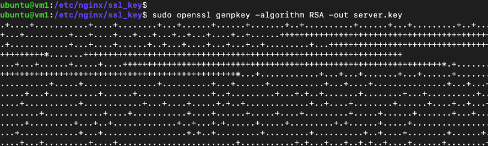
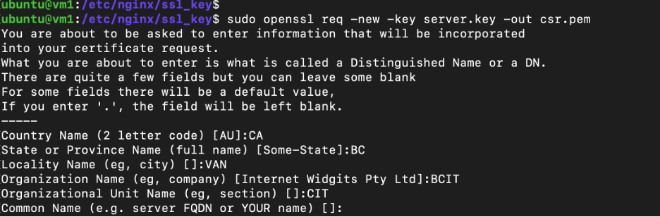
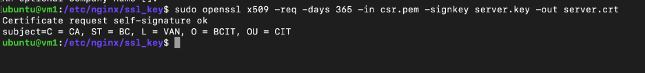
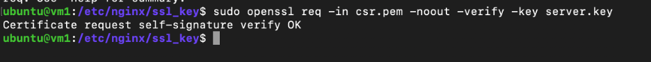
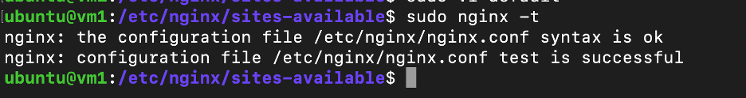
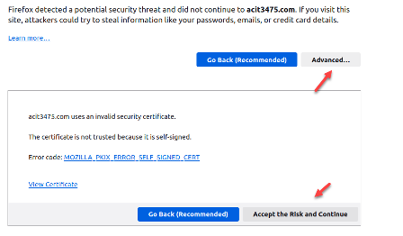

# Lab 6: SSL/TLS Certificate and Implemenetation

## Part 1: Generate a self-signed TLS Certificate

Generate a self-signed TLS certificate on your website that will be used by nginx
The process is as follows:
- Create a new private/public key pair
- Create a certificate signing request (CSR) based on your keys
- Create a Self-Signed Certificate based on your CSR
- You will have to choose and enter file names manually. Pay close attention to all parameters and which files are created by which step of the process.

The final certificate and key should have the following parameters:
- RSA key with 4096 bit key size
- Common Name: `<your nginx IP address>`

This process should result in three files:
|#| Files     | Description |
|-| --------  | ----------- |
|1| server.key| Private Key (extremely sensitive)|
|2| server.crt| TLS Certificate (includes the public key)|
|3| csr.pem   | Signing request. Can be deleted.|


### Step 1: Launch a Multipass and Ensure the network is attached.
On windows: 
```sh
multipass launch -n wsa-lab-7 --network Wi-Fi
```
On Mac/Unix: 
```sh
multipass launch -n wsa-lab-7 --network bridged 
```

### Step 2: Update and Upgrade the System Packages
```sh
sudo apt update && sudo apt upgrade -y
```

### Step 3: Install nginx
```sh
sudo apt install nginx -y
sudo systemctl start nginx
sudo systemctl enable nginx
```

### Step 4: Create a directory to store private key, public key and certificate.
```sh
sudo mkdir -p /etc/nginx/ssl_key
cd /etc/nginx/ssl_key
```

### Step 5: Install OpenSSL
```sh
sudo apt install openssl -y
```

### Step 6: Generate a Private Key
```sh
sudo openssl genpkey -algorithm RSA -out server.key
```

 
### Step 7: Generate a Certificate Signing Request (CSR)
```sh
sudo openssl req -new -key server.key -out csr.pem
```

During this step, you will be prompted to enter information such as the Common Name (CN), Organization, Country, etc. Make sure to enter the appropriate details for your SSL/TLS certificate.

 
### Step 8: Generate a Self-Signed Certificate
```sh
sudo openssl x509 -req -days 365 -in csr.pem -signkey server.key -out server.crt
```

### Step 9: Verify your key.
```sh
sudo openssl req -in csr.pem -noout -verify -key server.key
```


## Part 2: Configure HTTPS in Nginx
- The certificate and keys we configured previously are required for nginx to support HTTPS. The goal of our configuration will be to support HTTPS as well as non-HTTPS traffic. As HTTPS operates on a different port we need to configure nginx to listen on this port, and to enforce ssl. You can see an example configuration below. 
- HTTPS in nginx can be configured similar to a virtual host in a new server block, or you can add the directives to your existing server block for Port 80. In that case you would not have to repeat any of your configuration (locations, proxy etc.) in your second server block.
```nginx
server {
listen	443 ssl;
    ssl_certificate    www.example.com.crt;
ssl_certificate_key    www.example.com.key;
ssl_protocols       TLSv1 TLSv1.1 TLSv1.2;
        ...
}
```


### Step 10: Create a root directory for your website
```sh
sudo mkdir -p /var/www/wsalab7.info
```

### Step 11: Create `index.html` file for the landing page of your website
```sh
sudo nano /var/www/wsalab7.info/index.html
```
```html
<h1>Add A Desired Title For Your Website</h1>
```

### Step 12: Configure Nginx
Edit the Nginx configuration file using a text editor of your choice. 
Choose a website you like to have. (eg. wsalab7.info)
```sh
sudo nano /etc/nginx/sites-available/wsalab7.info
```
### Step 13: We need to define a server directive as below:
```nginx
server {
    listen 443 ssl;

server_name wsalab7.info www.wsalab7.info;
    
    ssl_certificate /etc/nginx/ssl_key/server.crt;
    ssl_certificate_key /etc/nginx/ssl_key/server.key;

    root /var/www/wsalab7.info;

    index index.html;

    location / {
        try_files $uri $uri/ =404;
    }
}
```

### Step 14: Save (Ctrl+S) and Exit (Ctrl+X) the nano. Now we need to Test Nginx Configuration
```sh
sudo nginx -t
```
Make sure the configuration test is successful.

 
### Step 15: If the test was successful, we need to create a symlink of the website’s config file into the site-enabled directory.
```sh
sudo ln -s /etc/nginx/sites-available/wsalab7.info \
/etc/nginx/sites-enabled/
```
### Step 16: Now it’s time to restart the nginx
```sh
sudo systemctl restart nginx
```

### Step 17: Allow Nginx and SSH in the Firewall
```sh
sudo ufw allow 'Nginx Full'
sudo ufw allow OpenSSH
sudo ufw enable
```
### Step 18: Before we perform the last test, we need to change the hosts file to be able to recognize the domain locally (on Ubuntu VM)
```sh 
sudo nano /etc/hosts
```
Add the line below to the hosts file:

`127.0.0.1 wsalab7.info`


### Step 18: Perform the last test. Open a browser on your host machine and visit `http://<YOUR_VM_IP>`, and then `https://<YOUR_VM_IP>`

Q1: Explain to your instructor: what are the differences in the result and why?

Notes: 
- The recommended location for your private key in Ubuntu is /etc/ssl/private
- Your certificate should be stored in /etc/ssl/certs
- Adjust the paths in the nginx configuration to match the location of your certificate and key
You WILL receive a security warning in any browser. This is normal for any self-signed certificate.


Q2: Show your instructor 
- the lines you added to your nginx configuration.
- the certificate details seen in your browser (Certificate Viewer in Chrome)

## Part 3: Enforce HTTPS through nginx
- At this point you should be able to access your web server through http:// (Port 80) as well as https:// (Port 443). Our final goal is to configure nginx to automatically redirect all regular HTTP traffic to HTTPS.
- Right now your configuration to support both ports might be either:
- One server block with two ports defined
- Two server blocks configured similarly
- The ideal configuration for HTTPS redirection is to have a very simple server block for port 80 that will return a permanent redirect to the request URL via HTTPS. The next request will then be captured by the SSL server block and contain all of your nginx configuration (proxies, locations, autoindex etc.)
- The configuration in the non-HTTPS block is trivial:

### Step 19: This server block directive will help us enforce HTTPS. We need to add this directive to our server config file:
```sh
sudo nano /etc/nginx/sites-available/wsalab7.info
```
```nginx
server {
    listen 80;
    server_name wsalab7.info www.wsalab7.info;
    return 301 https://$host$request_uri;
}
```

- For this task you should change your default site (where we did most of our configuration so far) to only support HTTPS on port 443. Add a new site with the minimal configuration above.
- Test your site configuration with curl. You should receive a HTTP 301 Permanent Redirect when you request any part of your site through HTTP.

Note: make sure to delete the default config file and its symlink to not have any issue when trying this last part:
```sh
sudo rm /etc/nginx/sites-available/default \
/etc/nginx/sites-enabled/default

sudo systemctl restart nginx
```

Q3: Show your instructor the Chrome (or your browser) Dev Tool. HTTP Headers which you received 301 Code as well as the location variable came with it.

## Links and Documentation
- TLS Certificates (Ubuntu): https://ubuntu.com/server/docs/security-certificates
- Configuring HTTPS servers (nginx): http://nginx.org/en/docs/http/configuring_https_servers.html
- OpenSSL usage (Ubuntu): https://help.ubuntu.com/community/OpenSSL
- nginx rewrite module (nginx): http://nginx.org/en/docs/http/ngx_http_rewrite_module.html
