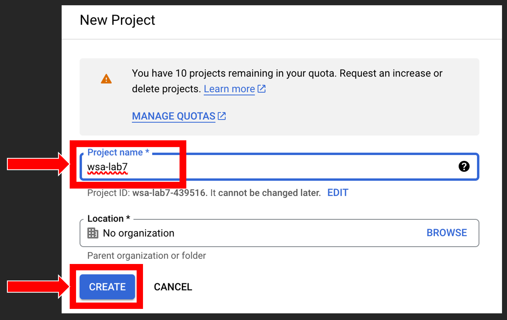

# Lab 7: Implementation of OAuth with Express.js

## Task 1: Implement OAuth (token-based authentication mechanism)
### Part I: Set up a express.js / node.js project

#### Steps:
1)	Turn on a Linux shell (could be on your Mac, Linux OS, in Linux VM, or AWS)
In this Lab I have used Multipass as a linux VM.


Make sure your VM has Public IP:


2)	We need to add our VM IP to the host file as a new domain (wsa-lab7.com) we about to use.


Host file in Windows OS: `C:\Windows\System32\Drivers\etc\hosts`
Host file in Linux/MacOs: `/etc/hosts`

3)	Enter the VM’s Terminal by:


4)	To install NPM and Express globally, run commands below:


```sh
sudo apt install npm
sudo npm install -g express-generator
sudo express lab7-oauth
cd lab7-oauth && sudo npm install
```

5)	Turn on the project with command:

```sh
sudo npm start
```


To verify: Open a browser in your Host Machine and hit: 

[http://wsa-lab7.com:3000/](http://wsa-lab7.com:3000/)

We should see this:


6)	Stop the Server and Update the project (Change `app.js` content and save the file)
Press CTRL + C to stop the Express Server

Before change:
  
After change:


If you have followed the instruction and used nano as your text editor, you can use these combinations to save and exit:
`CTRL + S` to save
`CTRL + X` to exit

7)	Now we need to install ejs as a new View Engine.
 


8)	In the folder “views”, rename two files using `mv` command:
- index.jade -> index.ejs
- error.jade -> error.ejs


9)	Change `index.ejs` contents to:

```html
<html>
    <body>
        <%=title %>
    </body>
</html>
```

 

10)	In the folder “routes”, change `index.js` contents
Change the title from 'Express' to ' wsa-lab7'

 

11)	After save (`CTRL + S`) and exit (`CTRL + X`), it’s time to restart the server by running:

 

12)	Verify the change in your browser with [http://wsa-lab7.com:3000](http://wsa-lab7.com:3000)

13)	Make a screenshot of your browser for demo


### Part II: Get Google dev credentials:
#### Steps:
1)	Open a browser, login with your Gmail, and then hit [https://console.developers.google.com/project](https://console.developers.google.com/project)

When you see the page below, push the button to create a new project


2)	In the next page as below, put in project name as “wsa-lab7”, and then push the “CREATE” button


3)	Wait till you see the notification as below, and then click the “SELECT PROJECT” link


4)	In the page below, choose “Go to APIs overview”


5)	Enable APIs and services


6)	Use the search bar to look for “google+”, in the result list, choose “Google + API”


7)	Search for “contacts” and from the results choose “contacts API” 

Enable it:

 
8)	Click the Google Cloud logo to get back to main dashboard, Then from Quick access, click on APIs and Services 

9)	In the sidebar, choose “OAuth consent screen”, then check “External”, “CREATE”


10)	Fill in “App name”, “User support email” and “Developer contact info”


11)	Use all default settings for the following two pages to finish the creation
12)	In the sidebar menu, choose Credentials, and then click “+CREATE CREDENTIALS”
In the dropdown, choose “OAuth client ID”


13)	Choose “Web application” as the type as below


14)	Fill in listed info
- Name:	wsa-lab7
- For Authorized JavaScript origins
    - ADD URI:	http://wsa-lab7.com 
- For Authorized redirect URIs
    - ADD URI:	http://wsa-lab7.com:3000/auth/google/callback        
- And then click “CREATE” button


15)	Now we have the Client ID and Client Secret in the popup


### Part III: Install middleware passport and Google strategy
#### Steps:
1)	Open a Linux shell (Or Ctrl+C to stop the project), and then run:


```sh
sudo npm install passport express-session passport-google-oauth20 --save
```

2)	In `app.js`, around line #10 in the importing section, add codes below. 

Note: if you use `nano`, you use `nano -l` to display line numbers. 


 
```js
var passport = require('passport');
var session = require('express-session');
var GoogleStrategy = require('passport-google-oauth20').Strategy;
passport.use(new GoogleStrategy({
    clientID: '', //you get this from Google, refer to your Part II
    clientSecret: '', //you get this from Google, refer to your Part II
    callbackURL: 'http://wsa-lab7.com:3000/auth/google/callback'},

  function(accessToken, refreshToken, profile, cb) {
cb(null, profile);
  }
));
```


 

Around line #27, right after express app has been defined, add:

```js
app.use(session({secret: 'cat'}));
app.use(passport.initialize());
app.use(passport.session());
passport.serializeUser(function(user, done) {
    done(null, user);
});
passport.deserializeUser(function(user, done) {
    done(null, user);
});
```


3)	Save the file (`CTRL + S`) and (`CTRL + X`) get back to the shell.
4)	We also need to setup our custom domain in host file in our VM. The multipass VM also need to know what IP does wsa-lab7.com refers to!


### Part IV: Set up Auth Router and create the view
#### Steps:
1)	In file `app.js` Under other routes related imports we need to add the auth.js file which we will create in the next step.

Around Line #9, in the importing section:

```js
var auth = require ('./routes/auth');
```


around Line #39, where rest of the views are being defined for express app:

```js
app.use('/auth', auth);
```


Don’t Forget: Save and Exit.

2)	In “routes” folder, create a file called `auth.js`
3)	Put contents below into the `auth.js` file

```js
var express = require('express');
var passport = require('passport');
var router = express.Router();

router.route('/google/callback').get(
  passport.authenticate('google', { failureRedirect: '/error/' }),
  function(req, res) {
    res.redirect('/');
  });

router.route('/google').get(
    passport.authenticate('google', {
        scope:['https://www.googleapis.com/auth/userinfo.profile', 
                'https://www.googleapis.com/auth/userinfo.email']
}));

module.exports = router;
```


Save and Exit.

4)	In directory/folder named views, create a file named `users.ejs`

```html
<html>
    <head></head>
    <body>
        <div>
            Hi <%=username%>
        </div>
</body>
</html> 
```


    
Save and Exit.


5)	Change `index.js` contents to: Note: you can find it in your routes directory.

```js
var express = require('express');
var router = express.Router();

/* GET home page. */
router.get('/', function(req, res, next) {
  if(req.user && req.user.displayName){
    const displayName = req.user.displayName;
    req.user.displayName = null;
    res.render('users', { username: displayName });
  } else{
    res.render('index', { title: 'wsa-lab7', salut:'please log in' });
  }
});

module.exports = router;
```


6)	Change `index.ejs` contents to:

```html
<html><body>  
<%=title %><br/>
<%=salut%>
<ul>
  <li>
    <a href = "/auth/google" >
      Google
    </a>
  </li>
</ul>
</body></html>
```


 
7)	 Restart the app, and then verify it in a browser.


